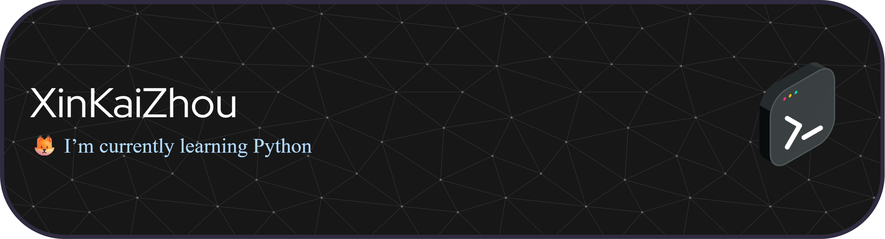

<div align="center">

# 👾 WELCOME TO THE T970 👾



```ascii
     _________  ________  ________  ________     
|\___   ___\\  ___  \|\_____  \|\   __  \    
\|___ \  \_\ \____   \\|___/  /\ \  \|\  \   
     \ \  \ \|____|\  \   /  / /\ \  \\\  \  
      \ \  \    __\_\  \ /  / /  \ \  \\\  \ 
       \ \__\  |\_______Y__/ /    \ \_______\
        \|__|  \|_______|__|/      \|_______|
                                                      
   ╔═══════════════════════════════════════╗
   ║  [THREAT HUNTER] [EXPLOIT DEVELOPER]  ║
   ║  "Nine Hundred Seventy Ways to Hack"  ║
   ╚═══════════════════════════════════════╝
```

```ascii
╔═══════════════════════════════════════════════════════════════╗
║  > Initializing security protocols...                         ║
║  > Access granted: Zhouxone | T970                            ║
║  > Status: Currently learning Python & Cybersecurity          ║
║  > Mode: CTF Player | Penetration Testing                     ║
╚═══════════════════════════════════════════════════════════════╝
```

</div>

---

## 🔐 </>WHO AM I

```python
class CyberSecurityEnthusiast:
    def __init__(self):
        self.name = "Zhouxone"
        self.role = "Security Researcher | Developer"
        self.learning = ["Python", "Web Security", "Penetration Testing"]
        self.interests = ["Bug Bounty", "CTF", "Ethical Hacking"]
    
    def say_hi(self):
        print("Thanks for dropping by! Let's hack the planet 🌍")

me = CyberSecurityEnthusiast()
me.say_hi()
```

---

## 🛠️ ARSENAL | TOOLS

<p align="center">
  
  
  
  
</p>

---

## ⚔️ TECH STACK | SKILLS

<p align="center">
  
  
  
  
  
  
</p>

---

## 🚩 CTF PLATFORMS | CHALLENGES

<p align="center">
  <a href="https://picoctf.org/" target="_blank">
    
  </a>
  
</p>

```
[+] CTF Status: Active Hunter
[+] Specialty: Web Exploitation | web developer
[+] Goal: Capture All The Flags 🚩
```

---

## 📊 GITHUB STATS

<div align="center">


</div>


---

## 🌐 CONNECT | SOCIAL

<p align="center">
  <a href="https://www.linkedin.com/in/rinaldy-camachou-92541628a" target="_blank">
    
  </a>
  <a href="https://github.com/Zhouxone" target="_blank">
    
  </a>
</p>

---

<div align="center">

### 🦊 "In a world of locked doors, be the key maker" 🔑


```
[+] System Status: Online
[+] Threat Level: Secured
[+] Mission: Learn, Break, Secure, Repeat
```


</div>

---

<div align="center">

**"Sometimes to do the right thing, you have to break a law.".**
*- Edward Snowden*

</div>